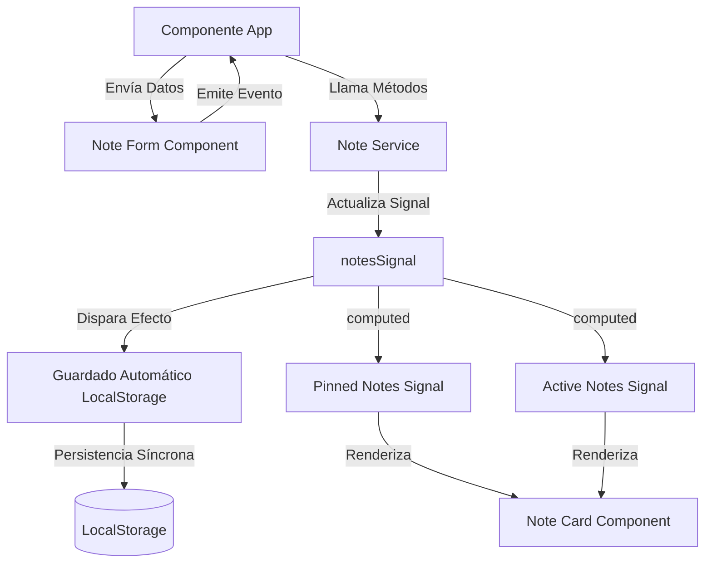

# ZenNotes - Arquitectura y Funcionalidades

ZenNotes es una aplicación web progresiva (PWA) de alto rendimiento, diseñada con una arquitectura moderna en Angular y una interfaz de usuario premium basada en Glassmorphism y temas oscuro/claro dinámicos.

---

## ⚡ Funcionalidades (Features)

La aplicación implementa las siguientes características clave:

### 1. CRUD Completo de Notas
* **Creación**: Formulario inteligente y colapsable (estilo Google Keep) que se expande al enfocar el cuadro de texto.
* **Edición**: Capacidad de editar el título, contenido, categoría y color de cualquier nota existente de forma interactiva.
* **Eliminación**: Confirmación de borrado para evitar pérdidas accidentales.

### 2. Organización y Clasificación
* **Fijación de Notas**: Permite "pinchar" notas importantes para mantenerlas en la sección superior ("Fijadas"), separadas del resto ("Otras").
* **Categorías**: Clasificación mediante etiquetas predefinidas: `Idea`, `Trabajo`, `Personal`, `Lista` y `Otros`.
* **Personalización de Colores**: Paleta interactiva con 5 tonos premium (`Emerald`, `Ocean`, `Purple`, `Rose`, `Amber`) que modifican el contorno y el brillo glassmorphic de la nota.

### 3. Filtros y Búsqueda en Tiempo Real
* **Buscador de Notas**: Barra de búsqueda en la cabecera que filtra notas instantáneamente por coincidencia en el título o contenido.
* **Filtros por Categoría**: Barra de chips deslizante para mostrar únicamente notas de una categoría específica o todas a la vez.

### 4. Capacidades PWA y Conectividad
* **Instalación Nativa**: Botón dinámico "Instalar App" en la cabecera que interactúa con la API del navegador (`beforeinstallprompt`) para permitir añadir ZenNotes a la pantalla de inicio del dispositivo.
* **Soporte Offline**: El Service Worker cachea los recursos de la aplicación para permitir su carga e interacción completas sin conexión a internet.
* **Detector de Conexión**: Indicador visual pulsante en la cabecera que muestra en tiempo real si el usuario está en línea ("En línea") o desconectado ("Sin conexión").

### 5. Interfaz y Experiencia Visual Premium
* **Diseño Glassmorphism**: Paneles translúcidos con desenfoque de fondo y bordes brillantes.
* **Tema Oscuro/Claro**: Selector rápido en la cabecera para alternar esquemas de color, con persistencia de preferencia en el dispositivo.
* **Micro-animaciones**: Transiciones de elevación al pasar el cursor por encima, efectos de pulsación de carga, y transiciones fluidas de inserción y eliminación.

---

## 🛠️ Arquitectura Técnica (Architecture)

La arquitectura del proyecto sigue los estándares modernos de desarrollo ágil en la web:

### 1. Stack Tecnológico
* **Core**: Angular 19+ (Basado en Componentes Standalone).
* **Gestión de Estado**: Angular Signals (`signal`, `computed`, `effect`) que reemplazan a RxJS en la reactividad local, garantizando un rendimiento óptimo y un código limpio.
* **Estilado**: Vanilla CSS estructurado con variables personalizadas (`:root` y `body.dark-theme`) para lograr un control total de la interfaz sin dependencias de frameworks externos pesados.

### 2. Flujo de Datos y Persistencia

* **NoteService**: Servicio raíz (`@Injectable({ providedIn: 'root' })`) que actúa como la fuente única de verdad para el almacenamiento de datos, control de conexión de red y definición de categorías y colores.
* **Efectos de Sincronización**: Un `effect` de Angular vigila los cambios de la señal del listado de notas y guarda el JSON de forma transparente en `LocalStorage`.
* **Carga Inicial**: Al instanciar el servicio, este recupera los datos guardados en el almacenamiento local y, si se encuentra vacío, precarga notas de demostración bien estructuradas para el usuario.

### 3. Configuración PWA
* **Angular Service Worker**: Implementa `@angular/service-worker`. La configuración en `ngsw-config.json` define dos grupos de caché principales:
  * `app`: Recursos críticos cargados con prioridad `prefetch` (`index.html`, scripts bundle, estilos CSS globales y favicons).
  * `assets`: Elementos multimedia y tipografías cargados bajo demanda (`lazy`) como las fuentes de Google (`Inter`, `Outfit`) e iconos de Material Round.
* **Manifesto**: `manifest.webmanifest` define la apariencia de la app al instalarse (modo `standalone`, color de fondo `#090d16`, orientación libre y un conjunto de iconos adaptables en la carpeta `public/icons/`).
